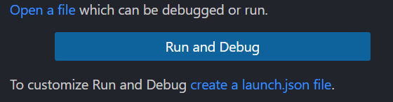
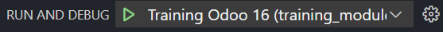
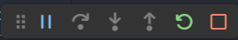
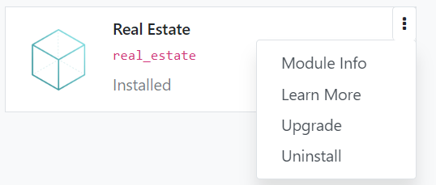
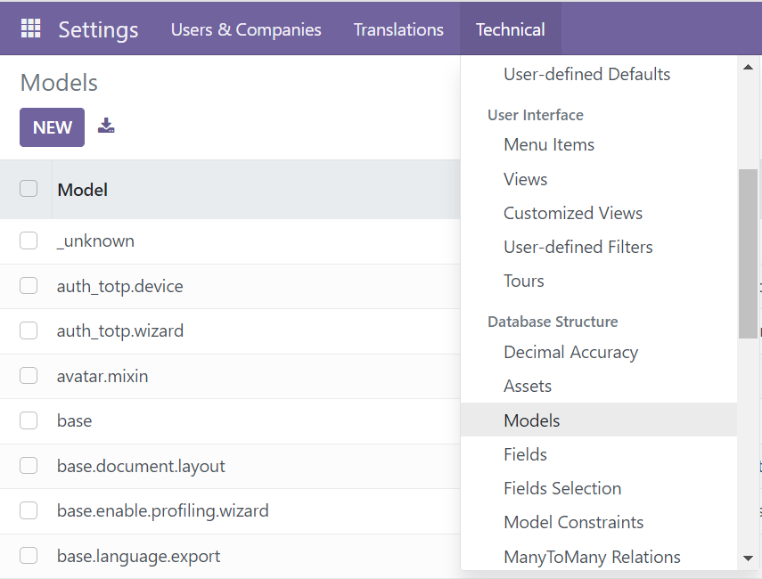
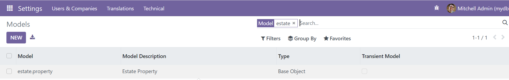
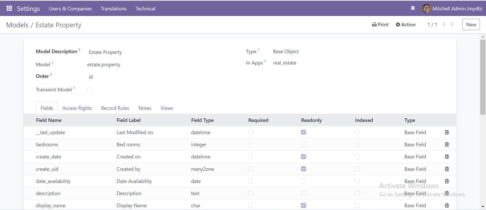
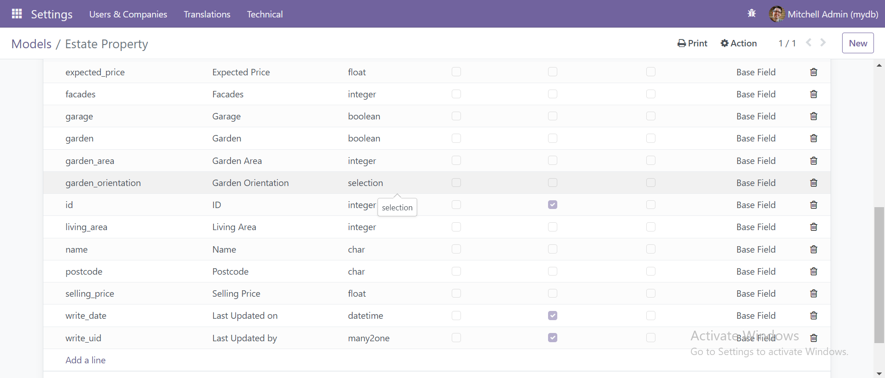

## Panduan Instalasi Odoo 16 di Windows
**Link Penting**
- https://www.odoo.com/documentation/16.0/developer/tutorials/getting_started.html
- https://www.odoo.com/slides/all

1. **Instal Python 3.8.10**
   - Install Python 3.8.10 dari Microsoft Store.
   - Buka Command Prompt (CMD) dan ketikkan perintah berikut untuk memastikan Python telah terdaftar pada sistem:
     ```
     python --version
     ```

2. **Instal PostgreSQL versi 15**
   - Download dan install PostgreSQL versi 15.
   - Saat instalasi, pilih password yang mudah diingat.
   - Setelah PostgreSQL terinstal, tambahkan folder `C:\Program Files\PostgreSQL\<version>\bin` dan `C:\Program Files\PostgreSQL\<version>\lib` PostgreSQL ke Path Environment Variables windows.
   - Untuk memastikan PostgreSQL berhasil terinstal, ketikkan perintah berikut di CMD:
     ```
     postgres --version
     ```

3. **Konfigurasi PostgreSQL**
   - Buka Command Promt atau cmd.
   - Masuk ke PostgreSQL dengan perintah:
     ```
     psql -U postgres
     ```
   - Masukkan password PostgreSQL yang telah Anda setup selama instalasi.
   - Setelah berhasil masuk, buat user baru dengan perintah berikut:
     ```
     CREATE USER odoo_user WITH PASSWORD 'odoo_user' CREATEDB CREATEROLE LOGIN;
     ```
   - Untuk memastikan user telah dibuat dengan role yang benar, ketikkan perintah:
     ```
     \du
     ```

5. **Install Git**
   - Download dan install Git dari [Git Downloads](https://git-scm.com/downloads).

6. **Clone Repository Odoo**
   - Buat folder baru bernama `Training`.
   - Buka Command Prompt didalam folder `Training`:
     ```
     cd Training
     ```
   - Clone repository Odoo dari GitHub dengan perintah:
     ```
     git clone --branch 16.0 --depth 1 https://github.com/odoo/odoo.git
     ```

7. **Setup Virtual Environment**
   - Buat virtual environment dengan Python:
     ```
     python -m venv env-odoo16
     ```
   - Aktifkan virtual environment:
     ```
     env-odoo16\Scripts\activate
     ```
   - Masuk ke folder `odoo`:
     ```
     cd odoo
     ```
   - Install dependencies `setuptools` dan `wheel`:
     ```
     pip install setuptools wheel
     ```
   - Install dependencies dari `requirements.txt`:
     ```
     pip install -r requirements.txt
     ```

### Running odoo Pertama Kali
1. Masuk ke folder Training
2. Buka CMD di folder tersebut
3. Lalu aktifkan virtual environment dengan menggunakan command:
```
env-odoo16\Scripts\activate
```
4. Masuk ke folder odoo
```
cd odoo
```
5. Running odoo dengan command
```
python odoo-bin -r dbuser -w dbpassword --addons-path=addons -d mydb
```
6. Buka odoo pada browser di localhost:8069
untuk login kita menggunakan:
email:admin
password:admin

### Menambahkan beberapa extensions pada vscode
pada bagian extension cari dan instal:
1. Rainbow CSV
2. python Debugger
3. Arkademy - Odo Technical Training
4. Odoo Code Snippets by Michell Stuttgart

### Menambahkan odoo conf(konfigurasi)
1. Pada folder Training, Buat sebuah folder untuk meletakkan module atau addons custom yang akan dibuat example: training_module
2. Lalu kembali ke folder Training dan buat folder `conf`
3. Dalam folder conf tersebut buat sebuah file dengan extension .conf (example : training.conf). didalam file tersebut copy konfigurasi berikut:
```
[options]
addons_path = C:\Users\firwin\Documents\Training\training_module,C:\Users\firwin\Documents\Training\odoo\addons
admin_passwd = odoo
db_host = localhost
db_name = False
db_password =odoo_user
db_port = 5432
db_user =odoo_user 
dbfilter =
http_port = 8010
xmlrpc_port = 8010
list_db = True
log_db = False
log_db_level = warning
log_handler = :INFO
log_level = info
logfile = 
default_productivity_apps = True
```

ket:
- addons_path = berisi semua folder addons/ module yang akan digunakan pada odoo, pada contoh diatas addonsnya berada pada folder training_module dan addons

### Menambahkan Module Custom baru
1. Masuk ke folder Training
2. Buka CMD
3. Aktifkan virtual environment
4. Masuk ke folder odoo
5. buat module baru dengan command
```
odoo-bin scaffold <nama module> <path folder dimana module akan diletakkan>
```

### Running Odoo dengan menggunakan debugger
1. buka vscode
2. lalu pada menu Run and Debug

klik create a lunch.json file

3. pilih folder tempat custom module kita. disini saya menggunakan folder `training module`
4. pilih python debugger
5. pilih python file, akan muncul sebuah file launch.json
6. lalu copy-kan konfigurasi berikut pada file launch.json tersebut: 
```
{
    "version": "0.2.0",
    "configurations": [
        
        {
            "name": "Training Odoo 16",
            "type": "debugpy",
            "request": "launch",
            "stopOnEntry": false,
            "console": "integratedTerminal",
            // untuk python isikan path python yang ada pada foder virtual environment
            "python": "C:/Users/firwin/Documents/Training/env-odoo16/Scripts/python",
            // untuk python isikan path file odoo-bin yang ada di folder odoo            "program": "C:/Users/firwin/Documents/Training/odoo/odoo-bin",
            "args": [
                // untuk config isikan file conf yang ada pada folder conf
                "--config=C:/Users/firwin/Documents/Training/conf/training.conf",
                "--dev=xml",
                // "--database=odoo16_arkana_training",
            ]
        },
    ]
}
```
7. lalu save dengan menekan ctrl+s
8. lalu run odoo dengan cara klik tombol


### membuat model pertama kali
Disclaimer : install module real_estate terlebih dahulu
1. buat file dengan extension .py pada module real_estate>models
example : estate_property.py
2. tambahkan juga pada file `__init__.py` yang ada di dalam folder models tersebut
```
from . import estate_property
```
3. buka file estate_property.py tadi
tambahkan script python berikut untuk menambahkan models
```
from odoo import models

class EstateProperty(models.Model):
    _name = 'estate.property'
    _description = 'Estate Property'
```
4. Restart odoo dengan menekan tombol hijau

5. upgrade module dengan cara:
- buka odoo di browser
- pergi ke apps
- lalu cari module real_estate
- pada pojok kanan atas pada module tersebut klik titik tiga lalu pilih upgrade.

6. cek apakah model berhasil tergenerate di odoo dengan cara
- pilih

- pilih setting
- pilih technical
- lalu pilih models
- cari model yang sudah kita buat tadi
example : estate_property


- jika ditemukan berarti model berhasil tergenerate

### menambahkan fields pada model
1. buka file python estate_property.py tadi
2. tambahkan fields yang diinginkan seperti contoh script python dibawah ini:
untuk jenis fields apa saja yang dapat ditambahkan dapat dilihat di 
[text](https://www.odoo.com/documentation/16.0/developer/reference/backend/orm.html#basic-fields)
```
from odoo import models, fields


class EstateProperty(models.Model):
    _name = 'estate.property'
    _description = 'Estate Property'

    name = fields.Char(string='Name')
    description = fields.Text(string='Description')
    postcode = fields.Char(string='Postcode')
    date_availability = fields.Date(string='Date Availability')
    expected_price = fields.Float(string='Expected Price')
    selling_price = fields.Float(string='Selling Price')
    bedrooms = fields.Integer(string='Bed rooms')
    living_area = fields.Integer(string='Living Area')
    facades = fields.Integer(string='Facades')
    garage = fields.Boolean(string='Garage')
    garden = fields.Boolean(string='Garden')
    garden_area = fields.Integer(string='Garden Area')
    garden_orientation = fields.Selection(string='Garden Orientation', 
                                          selection=[('n', 'N'),
                                                    ('s', 'S'),
                                                    ('e', 'E'),
                                                    ('w', 'W'),])
```

3. lalu restart odoo
4. upgrade module
5. untuk check field berhasil tergenerate buka
setting>technical>models, lalu cari model yang tadi dibuat. example : estate_property
6. double click pada model tersebut, lihat apakah fieldnya ada didalam model tersebut.


